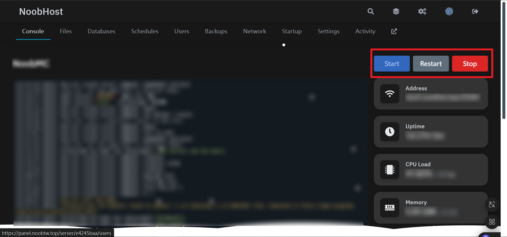
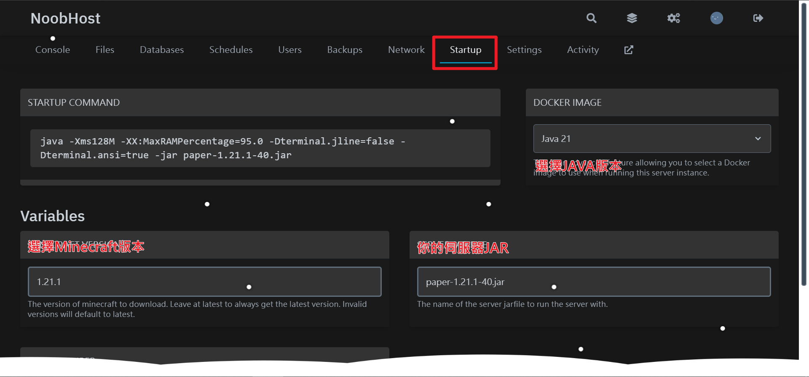
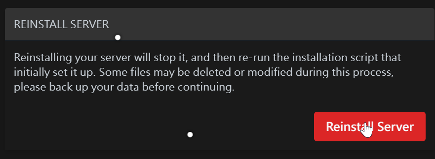

# 面板使用教學

## 開關機
開關機按鈕在您伺服器頁面的右上角
由左至右分別為 開機,重啟,關機

## 終端使用
往下滑，您可以在下方的輸入框輸入指令

另外，若為 Minecraft 伺服器，指令前則不需要加上`/`。(例如`/help`應輸入`help`)
## 檔案管理
透過上方選單切換到檔案管理頁面
在這裡你可以對檔案進行：重新命名/移動/調整權限/壓縮/刪除 等操作。

  
或是批量對文件進行：移動/檔案(這是壓縮的意思)/刪除 等操作。

## 計畫任務 (排程)
透過上方選單切換到排程頁面。
點擊Create schedule(創建排程)

排程時間可以參考以下範例或是打開下面的 顯示快速參考指令表
```
# 每天早上 8 點 30 分執行
30 08 * * *

# 每週日下午 6 點 30 分執行
30 18 * * 0

# 每週日下午 6 點 30 分執行
30 18 * *

# 每年 6 月 10 日早上 8 點 30 分執行
30 08 10 06 *

# 每月 1 日、15 日、29 日晚上 9 點 30 分各執行一次
30 21 1,15,29 * *

# 每隔 10 分鐘執行一次
*/10 * * * *

# 從早上 9 點到下午 6 點，凡遇到整點就執行
00 09-18 * * *
```
創建完成後進入，並點擊New Task(新任務)，在這裡設定你想執行的自動化

## 子用戶
透過左側選單切換到共同用戶頁面。
點擊New User(新增使用者)

接著如圖操作

## 啟動設定

如果修改版本號的話
需要至Setting頁面執行下列操作

[
](https://noobtw.top)
[
](https://panel.noobtw.top)
[
](https://discord.gg/FDSeuPU7JB)